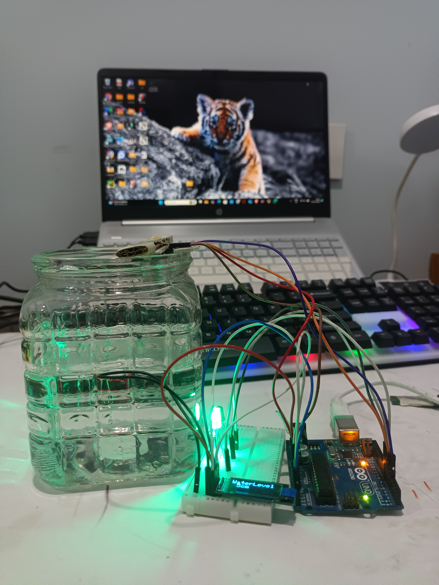
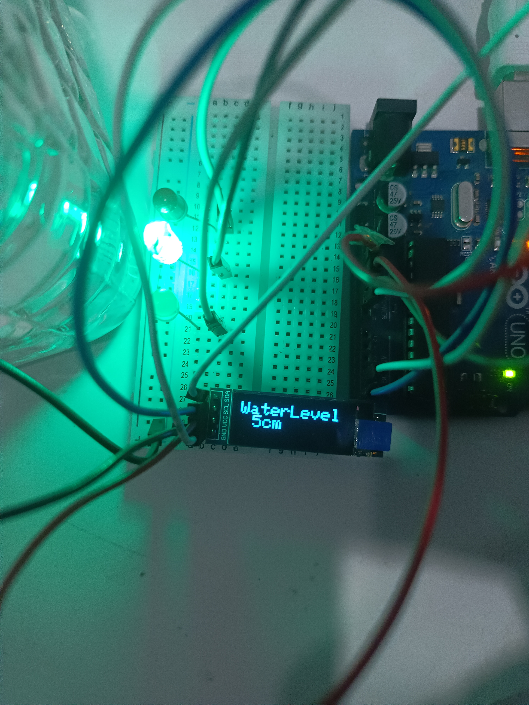
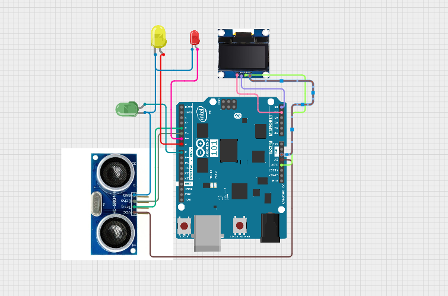

# Water Level Monitoring System (Arduino + Ultrasonic Sensor + OLED)

## 📌 Overview
This project is a **Water Level Monitoring System** that uses an ultrasonic sensor to measure the water level in a tank and displays it on an **OLED screen** in real-time. It provides visual and audio alerts using **LEDs** and a **buzzer** for different water levels.

---

## ✅ Features
✔ Real-time water level measurement  
✔ OLED display for live readings  
✔ LED indicators for Low, Medium, and High levels  
✔ Buzzer alarm for overflow warning  
✔ Simple and easy-to-build system  

---

## 🛠 Components Used
- **Arduino Uno**
- **Ultrasonic Sensor (HC-SR04)**
- **OLED Display (SSD1306)**
- **3 LEDs (Red, Yellow, Green)**
- **Buzzer**
- **Jumper Wires & Breadboard**

---

## 📂 Project Structure

---

## ⚡ How It Works
1. The ultrasonic sensor measures the distance to the water surface.
2. The system calculates the water level based on this distance.
3. OLED displays the water level in **cm**.
4. LEDs and buzzer indicate:
   - **Red LED** → Low level
   - **Yellow LED** → Medium level
   - **Green LED + Buzzer** → High level (near overflow)

---

## 🌐 Project Images
### ✅ Working Image 1

### ✅ Working Image 2

---

## 🖼 Circuit Diagram

---

## 📋 How to Use
1. Open `water_level_indicator_code.ino` in Arduino IDE.
2. Install required libraries:
   - `Adafruit_GFX.h`
   - `Adafruit_SSD1306.h`
3. Connect components as per **circuit diagram**.
4. Upload the code to **Arduino Uno**.
5. Power the circuit and monitor water levels on OLED.

---

## ✅ Future Improvements
- Add **Wi-Fi module (ESP8266)** for IoT-based monitoring.
- Store water level history in a **cloud database**.
- Add **mobile notifications** for overflow alerts.

---
